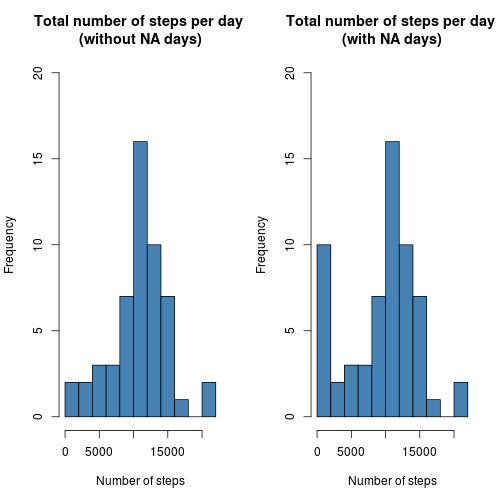

*Created* Sun Oct 19 18:46:08 2014

## Loading and preprocessing the data
Load all required libraries

```r
library(data.table)
library(lattice)
```

Create **data** folder in your workspace (if there is no such folder), download the original zip file and store it in the **data** folder.

```r
if (!file.exists("data")){
        dir.create("data")
}
fileUrl <- "https://d396qusza40orc.cloudfront.net/repdata%2Fdata%2Factivity.zip"
if (!file.exists("./data/activity.zip")){
        download.file(fileUrl, destfile = "./data/activity.zip", method = "curl")
}
```

Read data from the zip file and store it as a data table `activity`

```r
activity <- read.csv(unz("./data/activity.zip", "activity.csv"), header = TRUE)
activity <- as.data.table(activity)
activity$date <- as.Date(activity$date)
activity$steps <- as.numeric(activity$steps)
summary(activity)
```

```
##      steps             date               interval     
##  Min.   :  0.00   Min.   :2012-10-01   Min.   :   0.0  
##  1st Qu.:  0.00   1st Qu.:2012-10-16   1st Qu.: 588.8  
##  Median :  0.00   Median :2012-10-31   Median :1177.5  
##  Mean   : 37.38   Mean   :2012-10-31   Mean   :1177.5  
##  3rd Qu.: 12.00   3rd Qu.:2012-11-15   3rd Qu.:1766.2  
##  Max.   :806.00   Max.   :2012-11-30   Max.   :2355.0  
##  NA's   :2304
```

## What is mean total number of steps taken per day?
As one can see, all `NA` values in the dataset belong to the `steps` variable. What is more interesting, the following property holds:
*For any date, the variable* `steps` *has at least one missing value* **if and only if** *all its values for that day are missing. There are exactly 8 such days in the dataset.*  Let's call such days *NA days*.

One can have a look at

```r
split(activity$steps, activity$date)
```

to check that our data set has the property above.

It is probably better to completely exclude *NA days* from computations, rather than have 8 artificial days with 0 total steps. (The total number of steps for *NA days* would be 0 since after removing all missing values, such days would contain no observations, and the sum of elements of empty vector is 0). Therefore, it make sense to first calculate the total number of steps for each day and only after that remove missing values. 

Let's calculate the total number of steps taken each day:

```r
total <- activity[, list(totalSteps = sum(steps)), by = date]
summary(total)
```

```
##       date              totalSteps   
##  Min.   :2012-10-01   Min.   :   41  
##  1st Qu.:2012-10-16   1st Qu.: 8841  
##  Median :2012-10-31   Median :10765  
##  Mean   :2012-10-31   Mean   :10766  
##  3rd Qu.:2012-11-15   3rd Qu.:13294  
##  Max.   :2012-11-30   Max.   :21194  
##                       NA's   :8
```

Now remove missing vales: 

```r
total <- total[complete.cases(total),]
summary(total)
```

```
##       date              totalSteps   
##  Min.   :2012-10-02   Min.   :   41  
##  1st Qu.:2012-10-16   1st Qu.: 8841  
##  Median :2012-10-29   Median :10765  
##  Mean   :2012-10-30   Mean   :10766  
##  3rd Qu.:2012-11-16   3rd Qu.:13294  
##  Max.   :2012-11-29   Max.   :21194
```

As you can see, we have the same summary after we remove missing values

Make a histogram of the total number of steps taken each day

```r
hist(total$totalSteps, col = "steelblue", main = "Total number of steps per day", 
     xlab = "Number of steps", breaks = 12)
```

 

For comparison, let's remove missing values while computing

```r
total0 <- activity[, list(totalSteps = sum(steps, na.rm = TRUE)), by = date]
```

Look at the summary. The **min** value is now 0, which clearly affects the **mean** and **median** 

```r
summary(total0)
```

```
##       date              totalSteps   
##  Min.   :2012-10-01   Min.   :    0  
##  1st Qu.:2012-10-16   1st Qu.: 6778  
##  Median :2012-10-31   Median :10395  
##  Mean   :2012-10-31   Mean   : 9354  
##  3rd Qu.:2012-11-15   3rd Qu.:12811  
##  Max.   :2012-11-30   Max.   :21194
```

Now compare the plots: the right one has eight more 0-days

```r
par(mfrow = c(1, 2))
hist(total$totalSteps, col = "steelblue", 
     main = "Total number of steps per day \n(without NA days)", 
     xlab = "Number of steps", breaks = 12)
hist(total0$totalSteps, col = "steelblue", 
     main = "Total number of steps per day \n(with NA days)", 
     xlab = "Number of steps", breaks = 12)
```

 

```r
par(mfrow = c(1, 1))
```

Find the mean and median total number of steps taken per day. Actually, we have already know them from the summary, yet let's compute them again

```r
mean(total$totalSteps)
```

```
## [1] 10766.19
```

```r
median(total$totalSteps)
```

```
## [1] 10765
```

Again, see the difference if keep *NA days* in the dataset

```r
mean(total0$totalSteps)
```

```
## [1] 9354.23
```

```r
median(total0$totalSteps)
```

```
## [1] 10395
```

## What is the average daily activity pattern?
Find average number of steps taken per interval (across all days of the experiment). Here missing values are distributed across all intervals. Therefore, we remove them from the data set during the calculations

```r
average <- activity[, list(meanSteps = mean(steps, na.rm = TRUE)), by = interval]
head(average)
```

```
##    interval meanSteps
## 1:        0 1.7169811
## 2:        5 0.3396226
## 3:       10 0.1320755
## 4:       15 0.1509434
## 5:       20 0.0754717
## 6:       25 2.0943396
```

Make a time series plot of the 5-minute interval (x-axis) and the average number of steps taken, averaged across all days (y-axis)

```r
with(average, plot(interval, meanSteps, type = "l", xlab = "Interval",
                   ylab = "Number of steps", col = "blue",
                   main = "Averge number of steps taken per interval"))
```

 

Which 5-minute interval, on average across all the days in the dataset, contains
the maximum number of steps?

```r
which.max(average$meanStep)
```

```
## [1] 104
```

and the value is 

```r
average$interval[which.max(average$meanStep)]
```

```
## [1] 835
```

Calculate the total value of missing values in the data set. We already know that from the summary. Nevertheless, let's calculate it again. As we know,  all missing values are in the `steps` variable:

```r
length(which(is.na(activity$steps)))
```

```
## [1] 2304
```

## Imputing missing values
We know that if steps observations for any day contain at lest one missing value, they consist of missing values only. Therefore, the strategy *"use the mean/median for that day"* won't work. Let's use the strategy *"the mean for that 5-minute interval"* to impute missing values.

Using **data.table package**, set key `interval` to both the original `activity` data set and the date `average` that stores the mean total number of steps per interval. Merge the data tables and replace missing values of the variable `steps` with average values from the `meanSteps` . However, first we create a new copy of the `activity` data table.

```r
activity1 <- copy(activity)
setkey(activity1, interval)
setkey(average, interval)
activity1 <- merge(activity1, average)
activity1[is.na(steps), steps := meanSteps]
activity1[, meanSteps := NULL]
```


```r
summary(activity1)
```

```
##     interval          steps             date           
##  Min.   :   0.0   Min.   :  0.00   Min.   :2012-10-01  
##  1st Qu.: 588.8   1st Qu.:  0.00   1st Qu.:2012-10-16  
##  Median :1177.5   Median :  0.00   Median :2012-10-31  
##  Mean   :1177.5   Mean   : 37.38   Mean   :2012-10-31  
##  3rd Qu.:1766.2   3rd Qu.: 27.00   3rd Qu.:2012-11-15  
##  Max.   :2355.0   Max.   :806.00   Max.   :2012-11-30
```

```r
head(activity1, 8)
```

```
##    interval     steps       date
## 1:        0  1.716981 2012-10-01
## 2:        0  0.000000 2012-10-02
## 3:        0  0.000000 2012-10-03
## 4:        0 47.000000 2012-10-04
## 5:        0  0.000000 2012-10-05
## 6:        0  0.000000 2012-10-06
## 7:        0  0.000000 2012-10-07
## 8:        0  1.716981 2012-10-08
```

As you can see, all missing values have disappeared.

Calculate the total number of steps taken each day

```r
total1 <- activity1[, list(totalSteps = sum(steps)), by = date]
```

Make a histogram of the total number of steps taken each day. Below are comparison plots. Old data is without *NA days* 

```r
par(mfrow = c(3, 1))
hist(total$totalSteps, col = "steelblue", 
     main = "Total number of steps per day (without NA days)", 
     xlab = "Number of steps", breaks = 12, ylim = c(0,25))
hist(total0$totalSteps, col = "steelblue", 
     main = "Total number of steps per day (with NA days)", 
     xlab = "Number of steps", breaks = 12, ylim = c(0,25))
hist(total1$totalSteps, col = "steelblue", 
     main = "Total number of steps per day (imputed NA values)", 
     xlab = "Number of steps", breaks = 12, ylim = c(0,25))
```

 

```r
par(mfrow = c(1, 1))
```

From the graph one can see that after we imputed missing values with estimates, 8 artificial 0-steps days have transformed into "post popular" days with approximately 11k steps.

Find again the mean and median total number of steps taken per day

```r
mean(total1$totalSteps)
```

```
## [1] 10766.19
```

```r
median(total1$totalSteps)
```

```
## [1] 10766.19
```
and compare them with the old values.

The old values obtained from the data set without *NA days*

```r
mean(total$totalSteps)
```

```
## [1] 10766.19
```

```r
median(total$totalSteps)
```

```
## [1] 10765
```

**Result**: Clearly, and as one could expect, our initial strategy with removing *NA days* from the  data set gave us essentially the same results as the strategy that replaces each missing value with the mean value of steps for a corresponding interval.

The old values obtained from the data set that includes *NA days*

```r
mean(total0$totalSteps)
```

```
## [1] 9354.23
```

```r
median(total0$totalSteps)
```

```
## [1] 10395
```

**Result**: If we compare results obtained from the new data set and the original one that 
includes NA days, the difference is pretty significant. Clearly, once we replace `NAs` with
estimates and run our analysis, we won't get 0 total steps for 8 *NA days*. Instead, we will get some positive values calculated from the estimates. As a result, both the **mean** and **median** total number of steps per day have increased.

## Are there differences in activity patterns between weekdays and weekends?
Create a new factor variable in the dataset with two levels – "weekday" and "weekend"
indicating whether a given date is a weekday or weekend day.

```r
activity1[weekdays(date) %in% c("Saturday", "Sunday"), day := "weekend"]
```


```r
head(activity1, 8)
```

```
##    interval     steps       date     day
## 1:        0  1.716981 2012-10-01      NA
## 2:        0  0.000000 2012-10-02      NA
## 3:        0  0.000000 2012-10-03      NA
## 4:        0 47.000000 2012-10-04      NA
## 5:        0  0.000000 2012-10-05      NA
## 6:        0  0.000000 2012-10-06 weekend
## 7:        0  0.000000 2012-10-07 weekend
## 8:        0  1.716981 2012-10-08      NA
```


```r
activity1[is.na(day), day := "weekday"]
```


```r
head(activity1, 8)
```

```
##    interval     steps       date     day
## 1:        0  1.716981 2012-10-01 weekday
## 2:        0  0.000000 2012-10-02 weekday
## 3:        0  0.000000 2012-10-03 weekday
## 4:        0 47.000000 2012-10-04 weekday
## 5:        0  0.000000 2012-10-05 weekday
## 6:        0  0.000000 2012-10-06 weekend
## 7:        0  0.000000 2012-10-07 weekend
## 8:        0  1.716981 2012-10-08 weekday
```


```r
activity1 <- transform(activity1, day = as.factor(day))
```

Find average number of steps taken per interval (across all days of the experiment, split by the "category" of a day):

```r
average1 <- activity1[, list(meanSteps = mean(steps, na.rm = TRUE)),
                      by = list(interval, day)]
head(average1, 8)
```

```
##    interval     day  meanSteps
## 1:        0 weekday 2.25115304
## 2:        0 weekend 0.21462264
## 3:        5 weekday 0.44528302
## 4:        5 weekend 0.04245283
## 5:       10 weekday 0.17316562
## 6:       10 weekend 0.01650943
## 7:       15 weekday 0.19790356
## 8:       15 weekend 0.01886792
```

Make a panel plot containing a time series plot of the 5-minute interval (x-axis) and the average number of steps taken, averaged across all weekday days or weekend days (y-axis)

```r
xyplot(meanSteps ~ interval | day, data = average1, 
       layout = c(1, 2), type = "l",
       xlab = "Interval", ylab = "Number of steps",
       main = "Averge number of steps taken per interval")
```

 
